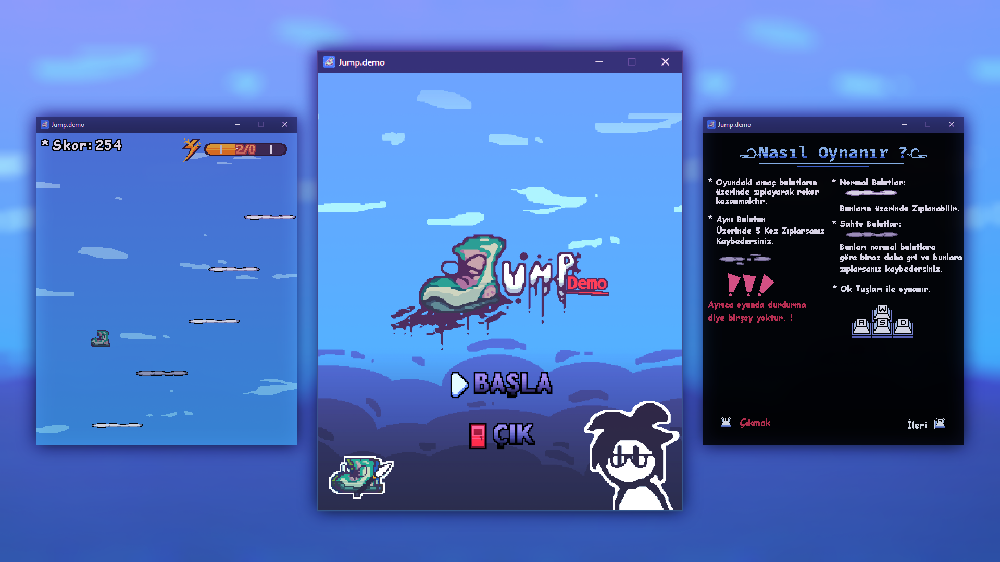

# Jump (Demo)

Bu benim yaptığım bir bağımsız bir okul proje oyunum :D

> [!CAUTION]
> Bu oyun bir demo'dur (üşenmesem devam edecem.)

# Ekran Görüntüsü 🖼️



# Kurulum 🔨

## Git ile yükle 📎
```cmd
git clone https://github.com(Mav1zz/Jump.demo.git
```

## Direkt yükle 📦
> sağ taraftan realest kısmından zip dosyasını indirebilirsin. (zip dosyasının içinde o kadarınıda bil.)

## Desteklenen platformlar 📱
Şimdilik `Windows` tabanlı sistemlerde çalışır daha sonra `linux`,`macos` ve `android` getirmeyi düşünüyorum.

# Kalan şeyler 😐

> Oyun `Python` dilinde yazılmıştır. (açık kaynaklı :D)

### Sorular ve Cevaplar:
- S: Karakter Neden Ayakabı ?
- C: Neden olmasın :D
- 
- S: Neden böyle bir oyun ?
- C: Aslında farklı bir fikrim vardı ama o olmadı :( bende böyle bir oyun yaptım.
-
- S: sa :D
- C: as.


# Kontroller ⚙️

| Tuşlar          | Olayı                                                                        |
| --------------- | :--------------------------------------------------------------------------- |
| ← →             | Sağ ve sol'a haraket etmek için :|                                           |
| Num 0           | Ultiyi Açar.				                                                         |
| + ve -          | Sesi artırır, azaltır.                                                       |

# Yapımcı  
- Maviz. (resim, kodlama, oyun [MÜZİKLER BENİM DEĞİLDİR.])
